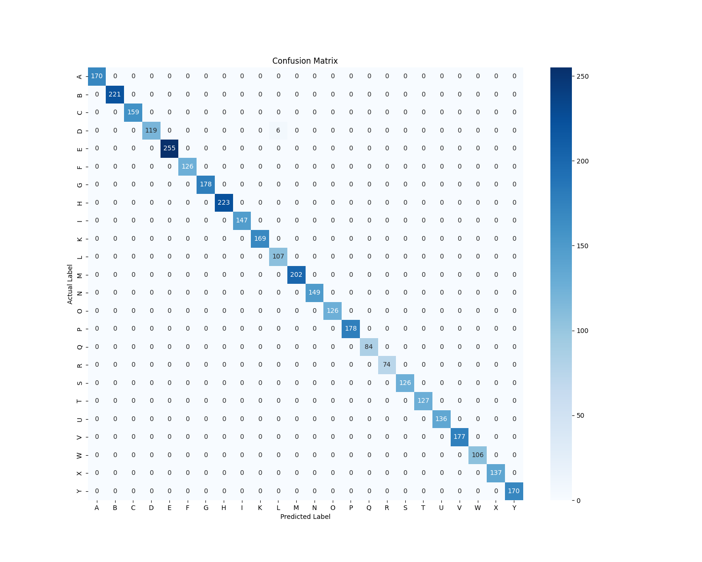

# ✋ Hand Gesture Recognition

This project focuses on building a machine learning model to recognize different hand gestures from image data. It aims to automate gesture classification — a key part of human-computer interaction systems like sign language translation or touchless control interfaces.

---

## 🎯 Objectives

- Preprocess gesture images
- Fine-tune the pre-trained **ResNet18** model to distinguish between different hand gestures
- Evaluate the model performance
- Predict new images in real-world scenarios

---

## 🧠 Techniques & Tools

- **Libraries**: `NumPy`, `Pandas`, `scikit-learn`, `matplotlib`, `seaborn`, `PyTorch`
- **Model**: Fine-tuned **ResNet18** from `torchvision.models`
- **Evaluation Metrics**: Confusion Matrix, Accuracy, F1-Score

---

## 📊 Dataset

- Dataset: **Sign Language MNIST**
- Contains labeled images of hand gestures like "A", "B", "C", etc.
- Images are preprocessed (resized, normalized) before being fed into the model.

🔗 [Kaggle Dataset - Sign Language MNIST](https://www.kaggle.com/datasets/datamunge/sign-language-mnist)

## ✅ Results
- Achieved F1-Score: **99.84%**
- Model successfully generalizes on real-world hand gesture images

### 📌 Confusion Matrix

